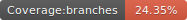
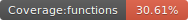
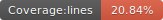
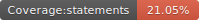

# FuckPress

<p float="left">
  
  
  
  
</p>

<p align="center">
    
</p>

Yes, another lightweight, headless and simple static page generator but on steroids. 

Made with love <3

## Requirements

- Nodejs
- Html pages

## Demo

- https://fuckpress.github.io/fuckpress-demo/
  - Hosted with github page
  - source: https://github.com/fuckpress/fuckpress-demo

## Install

Install the tool

```
npm install -g github:/fuckpress/fuckpress-core
```

## Create new site

```
fuckpress --new-site acme
cd ./acme
```

## Start

```
fuckpress --start
```

Go to http://localhost:2708 and you will see the demo

<p align="center">
 
</p>

## Publish

After the creation of your markdowns and settings, if you need a static site to be hosted in some server, follow these steps

Generate the static site

```
fuckpress --publish
```

By default, it creates a **site** folder. If you need a custom folder:

```
fuckpress --publish --output=docs
```

## How to customize?

Just add a new field in **config.yaml**:

```
foo : bar
```

And put this field wherever you want in your html using [handlebars](https://handlebarsjs.com/contributing/interactive-examples.html) syntax

```
<h1>{{foo}}</h1>
```

Finally, refresh the url 

## Your own theme

Just download any theme from internet with the classic index.html and set the fields from the **config.yaml** using [handlebars](https://handlebarsjs.com/contributing/interactive-examples.html) syntax

```
<title>{{site_name}}</title>
```

## For nodejs developers (contributors)

Clone this repository and execute

```js
npm run dev
```


## Acknowledgments

- https://www.brandcrowd.com/maker/logos
- https://github.com/lemidia/shopping-website-javascript
- https://github.com/creativetimofficial/awesome-landing-page


## Roadmap

- Check the issues page

## Contributors

<table>
  <tbody>    
    <td>
      
      <br />
      <label><a href="http://jrichardsz.github.io/">JRichardsz</a></label>
      <br />
    </td>
  </tbody>
</table>
